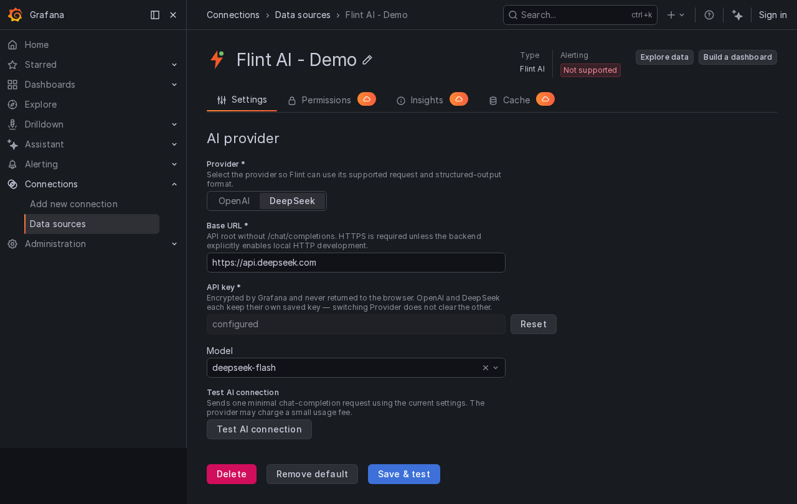

# Flint AI Datasource

[简体中文](README.zh-CN.md)

Flint AI Datasource is a Grafana data source plugin for Flint Panel. It stores AI provider settings securely and sends chat and chart-generation requests through the Grafana backend.

Supported providers:

- OpenAI
- DeepSeek



## Requirements

- Grafana 13.1.0 or later
- Node.js 22 or later (development only)
- Go 1.26.6 or later (development only)
- Docker and Docker Compose (local Grafana only)

## Configure the data source

1. In Grafana, add the **Flint AI Datasource** data source.
2. Select **OpenAI** or **DeepSeek**.
3. Check the default **Base URL**, or enter a custom URL.
4. Enter the API token for the selected provider.
5. Open **Model** and select a model, or type a custom model ID and press **Enter**.
6. Select **Test AI connection**.
7. Save the data source.

OpenAI and DeepSeek keep separate API tokens and model selections. If the model list is unavailable, you can still enter a model ID manually.

> **Note:** Testing the connection sends a small request to the provider and may incur a small charge.

## Security

- API tokens are stored in Grafana `secureJsonData`.
- Saved tokens are never returned to the browser.
- The browser never calls OpenAI or DeepSeek directly.
- Provider errors are cleaned before they are returned to the browser.
- Unsaved connection previews and connection tests require a Grafana organization administrator.
- Provider DNS answers are pinned per connection and private, loopback, link-local, and special-use destinations are blocked.
- Provider resources are limited to four concurrent requests and 30 requests per user per minute.

Provider requests connect directly instead of using process-level HTTP proxies so that destination validation cannot be bypassed. For local development only, `FLINT_AI_ALLOW_LOCAL_HTTP=true` permits the private stub-provider network. Do not enable this setting in production.

## Backend resources

| Resource               | Purpose                                                |
| ---------------------- | ------------------------------------------------------ |
| `GET /health`          | Check saved configuration without calling the provider |
| `GET /models`          | Load models with the saved connection                  |
| `POST /models/preview` | Load models with unsaved settings without storing them |
| `POST /test`           | Test the provider connection                           |
| `POST /chat`           | Send a bounded chat request                            |
| `POST /generate`       | Generate a Flint chart proposal                        |
| `POST /repair`         | Repair one rejected chart proposal                     |

## Local development

```bash
npm ci
npm run build
npm run build:backend
npm run server
```

Grafana starts at <http://localhost:3000>. The local stack also starts a stub AI provider on port `18080`, so end-to-end tests do not need a real API token.

Useful commands:

| Command                  | Purpose                                    |
| ------------------------ | ------------------------------------------ |
| `npm run dev`            | Watch and rebuild the frontend             |
| `npm run typecheck`      | Check TypeScript types                     |
| `npm run lint`           | Run ESLint                                 |
| `npm run test:ci`        | Run frontend unit tests                    |
| `go test ./... -count=1` | Run backend tests                          |
| `npm run e2e`            | Run end-to-end tests against local Grafana |

## Prepare a release

Release preparation and tagging are deliberately separate:

```bash
./scripts/release-pre.sh 0.2.0
git add package.json package-lock.json CHANGELOG.md
git commit -m 'chore(release): v0.2.0'
./scripts/release-pre.sh 0.2.0 --tag
git show v0.2.0
git push origin v0.2.0
```

The script never commits or pushes. Tag creation requires matching package and lockfile versions, a matching Changelog section, and a clean working tree. Pushing the tag starts the gated GitHub release workflow; only after its frontend, backend, vulnerability, and security checks pass does the official Grafana action build a draft with the release artifacts, after which the workflow publishes it as the latest GitHub Release.

## License

Apache-2.0. See [LICENSE](LICENSE).
